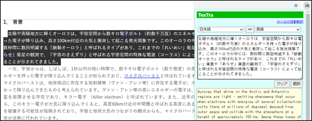
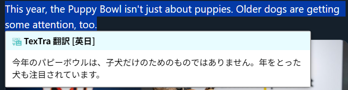

#  TexTra Chrome/Edge

**TexTra Chrome/Edge**は  Webブラウザ、ChromeとEdgeで 
サイト翻訳、テキスト翻訳、辞書引き機能を提供します。 
外国語の学習をサポートします。 

**TexTra Chrome/Edge** is a browser extension for Google Chrome and Microsoft Edge. It provides website translation, text translation, and dictionary lookup features. It supports your foreign language learning.. 

  
  

---
## 📥インストール Install

下記の画面でインストールボタンを押してください。 
chromeウェブストア - TexTra 
https://chromewebstore.google.com/detail/textra/mhnnkoiolmjhfkcjppolhbmobkbjfbdi?hl=ja 

ヘルプ 
https://nict-dev.github.io/TexTra-Chrome/ja/help_main.html 

................................................................................................................................................ On the following page, please click the Install button. 
Chrome Web Store – TexTra 
https://chromewebstore.google.com/detail/textra/mhnnkoiolmjhfkcjppolhbmobkbjfbdi?hl=en 

Help 
https://nict-dev.github.io/TexTra-Chrome/en/help_main.html 

------
##  みんなの自動翻訳 Min'na no Jido Hon'yaku

アプリ内では「みんなの自動翻訳」のアカウントが必要です。 
https://mt-auto-minhon-mlt.ucri.jgn-x.jp/

サーバーメンテナンスなどで 
一時的にご利用いただけないことがあります。 
サーバーメンテナンス情報などは下記をご確認ください。 
X(Twitter) 
https://twitter.com/minhonMT

................................................................................................................................................ 
A "Min'na no Jido Hon'yaku"  account to use the app. 
https://mt-auto-minhon-mlt.ucri.jgn-x.jp/

The service may be temporarily unavailable due to server maintenance.  
For server maintenance information, 
please check the details below. 
X(Twitter) 
https://twitter.com/minhonMT

------
## 💻 実行環境 System Requirements

Webブラウザ： Chrome、Edge 

Web browser: Chrome, Edge 

------
みんなの自動翻訳 - TexTra Chrome (古い内容が含まれています。) 
Min'na no Jido Hon'yaku - TexTra Chrome (The information on the linked page is outdated.) 
https://mt-auto-minhon-mlt.ucri.jgn-x.jp/content/tool/chrome/ 

------
## 🦤TexTra Screen Reader for Chrome 

**TexTra Screen Reader for Chrome**は 
ブラウザアプリChromeの拡張「TexTra Chrome」に、 
OCRでWindows上のテキストを取得する機能を追加するアプリケーションです。 
https://github.com/NICT-Dev/TexTra-Screen-Reader-for-Chrome 

**TexTra Screen Reader for Chrome** is an application 
that works with the Chrome extension "TexTra Chrome" 
and adds OCR-based text capture feature for Windows. 
https://github.com/NICT-Dev/TexTra-Screen-Reader-for-Chrome 

        